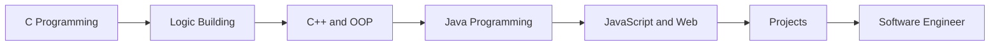

<div align="center">


<br>

<a href="https://github.com/rushikeshspuri/Programming">
  
</a>
<a href="mailto:rushikesh.puri7499@gmail.com">
  
</a>

<br><br>


</div>

---

## About Me

I am Rushikesh Puri, a programming learner focused on logic building, clean code organization, and consistent practice. My GitHub is my public learning space where I upload programs, assignments, practice work, and future projects as I grow into a skilled software engineer.

My goal is simple: learn deeply, practice daily, build useful projects, and become a good software engineer with strong fundamentals.

```c
while (learning) {
    practice();
    build_logic();
    improve_code();
    stay_consistent();
}
```

---

## My GitHub Purpose

<table>
  <tr>
    <td><b>Practice</b></td>
    <td>Upload daily programs and strengthen problem-solving skills.</td>
  </tr>
  <tr>
    <td><b>Competitive</b></td>
    <td>Store assignment solutions, coding questions, and logic-building problems.</td>
  </tr>
  <tr>
    <td><b>Projects</b></td>
    <td>Build real projects as I improve my programming and software development skills.</td>
  </tr>
  <tr>
    <td><b>Growth</b></td>
    <td>Track my journey from beginner programs to professional-level software work.</td>
  </tr>
</table>

---

## Programming Repository

<div align="center">

<a href="https://github.com/rushikeshspuri/Programming">
  
</a>

</div>

```text
Programming
|-- C_programming
|   |-- Practice
|   |-- Competative
|   `-- Project
|-- java_programming
|   |-- Practice
|   |-- Competative
|   `-- Project
|-- C++_Programming
|   |-- Practice
|   |-- Competative
|   `-- Project
`-- Java_Script_Programming
    |-- Practice
    |-- Competative
    `-- Project
```

---

## Skills & Tools

<div align="center">


</div>

<br>

<table>
  <tr>
    <td align="center"><b>C</b><br>Logic building and fundamentals</td>
    <td align="center"><b>C++</b><br>OOP and problem solving</td>
    <td align="center"><b>Java</b><br>Core programming and structure</td>
    <td align="center"><b>JavaScript</b><br>Web development</td>
  </tr>
  <tr>
    <td align="center"><b>MongoDB</b><br>Database</td>
    <td align="center"><b>MySQL</b><br>Database</td>
    <td align="center"><b>VS Code</b><br>Code editor</td>
    <td align="center"><b>IntelliJ IDEA</b><br>Java IDE</td>
  </tr>
</table>

---

## Learning Roadmap



---

## GitHub Activity

<div align="center">


<br><br>


</div>

---

## Current Focus

<div align="center">

| Focus Area | What I Am Doing |
|---|---|
| Programming | Practicing C, C++, Java, and JavaScript |
| Logic Building | Solving programs from basic to advanced |
| Organization | Keeping code structured inside one clean repository |
| Projects | Preparing to build real-world software projects |
| Career Goal | Becoming a good software engineer |

</div>

---

## Connect With Me

<div align="center">

<a href="mailto:rushikesh.puri7499@gmail.com">
  
</a>
<a href="https://linkedin.com/in/rushikesh~puri">
  
</a>
<a href="https://instagram.com/30_rushii">
  
</a>
<a href="https://x.com/Rushi_codes">
  
</a>

</div>

---

<div align="center">

<b>Learning every day. Building step by step. Growing into a software engineer.</b>


</div>
